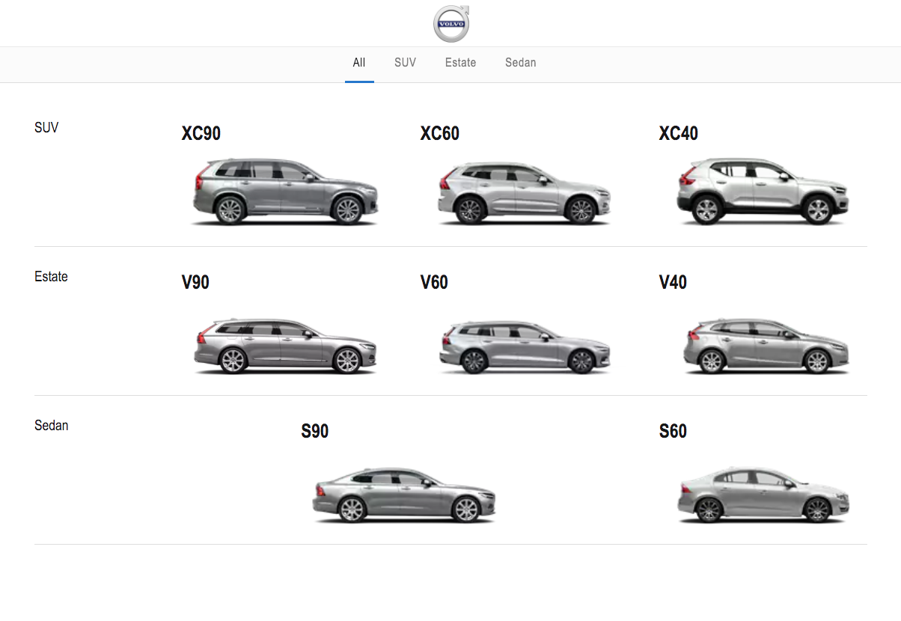

# Cars Explorer

This is a simple website reading cars data from API and showing them in a grid with simple filter.
It is build using React, Redux and CSS.

## Screenshot

## How to run it

### First you need to run the server

- Change directory to '/server'
- Run `yarn install` or `npm install`
- Run `yarn start` or `npm start`

### Then you can start the client app

- start a new terminal
- Change directory to '/app'
- Run `yarn install` or `npm install`
- Run `yarn start` or `npm start`

## Run tests

- Change directory to '/server'
- Run `yarn test` or `npm test`
- Change directory to '/app'
- Run `yarn test` or `npm test`
